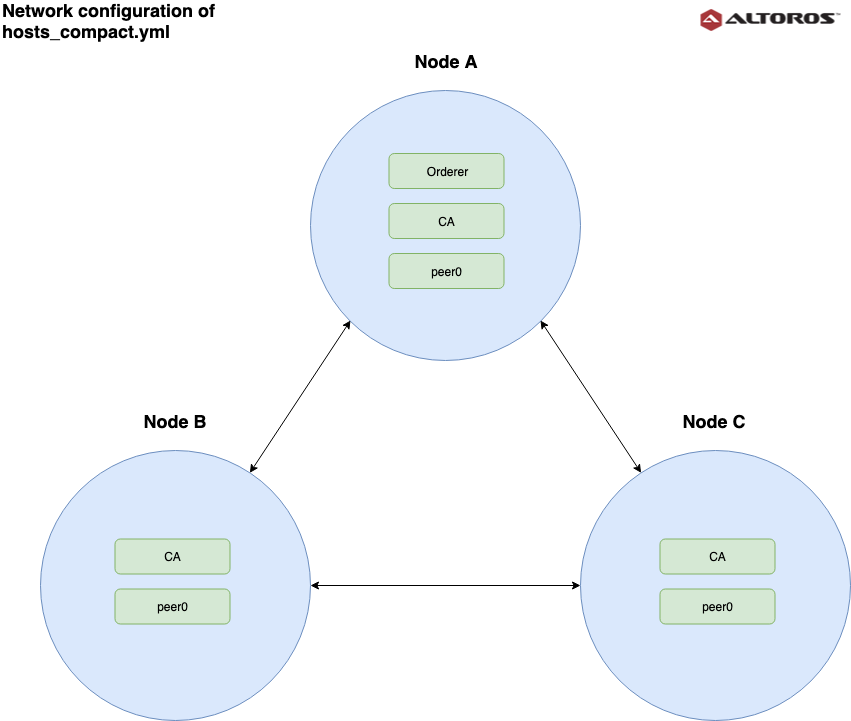
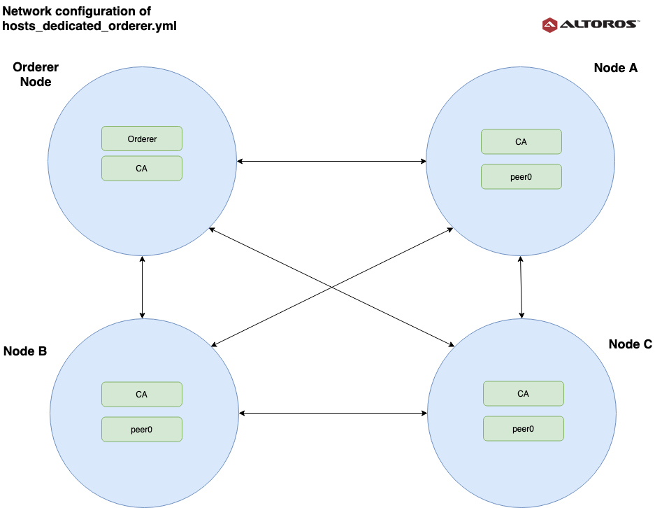
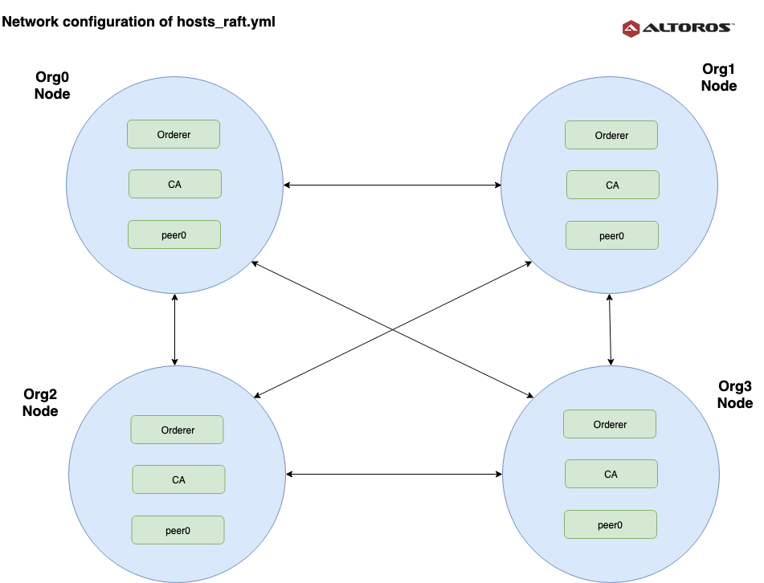

# Ansible fabric starter by Altoros
This project contains playbooks and roles for deployment of Hyperledger fabric project on multiple instances. 
Everything is running inside docker-containers, and managed by docker-compose. 
Assumed that 1 physical (or virtual) host will serve one organisation, so **only multi-host deployment is supported** by this tool.
 
## Quick overview:
* Hyperledger Fabric v1.4.1
* TLS enabled on all configurations
* etcdraft, kafka and solo orderers are supported
* CouchDB and LevelDB peer database supprted
* Configurable amount of organisations
* Configurable amount of channels
* 1 chaincode for common channel, and 1 other chaincode for everything else
* Build-in hyperledger fabric explorer
* Build-in Altoros RestAPI

## Technical Requirements:
Your machine should have:
* GNU/Linux operating system
* ansible 2.5.0+ 

You can find installation instructions on [ansible website](http://docs.ansible.com/ansible/latest/installation_guide/intro_installation.html).

Provisioned nodes by ansible should have:
* Ubuntu 16.04, Debian 9+ or CentOS 7
* python
* sudo access

**At least 2GB of RAM if you are using kafka-orderer.**

## Ports, used by default, you probably want to whitelist them in your firewall.

### Ports, needed for blockchain instances to communicate with each other:

* **7050** - Hyperledger fabric orderer port
* **7054** - Hyperledger fabric CA port
* **7051** - Hyeprledger fabric peer port
* **7053** - Hyperledger fabric peer event port
* **22** - ssh, or any other port number, needed for inital ansible deployment only

In case of kafka-orderer:

* **9092** - Kafka broker port
* **2181** - Kafka zookeper port
* **2888** - Kafka zookeper port
* **3888** - Kafka zookeper port

### Ports, you may want (or may not) open to the internet:

* **4000** - Altoros RestAPI
* **8080** - Hyperledger Blockchain Explorer web-app

## Instructions

#### How can I clone this repositry?

```git clone https://github.com/Altoros/Ansible-Fabric-Starter.git```

#### How should I configure my blockchain network?

You can find three example-configurations:

   
- **hosts_compact.yml** - Solo orderer, 3 organizations, orderer-service is hosted on first's organization node. Only common channel is enabled.


   
- **hosts_dedicated_orderer.yml** - Solo orderer, 3 organizations, orderer-service is hosted on separated node. 3 private channels between all organizations.


   
- **hosts_kafka.yml** - Kafka orderer, 3 organizations, each organization has own copy of orderer-service. 3 private channels between all organizations.
   
   
   
- **hosts_raft.yml** - EtcdRaft orderer, 4 organizations, each organization has own copy of orderer-service. 2 private channels between first three organizations.

If blockchain network architecture is pre-configured (or you may want to run default settings), 
you just need to specify ip-address of each host in `ansible_host`, user with sudo access in `ansible_user`. 
`domain` and machine domain-name (e.g. `one.example.com`) is mainly required for docker network, so you can set values you need.

Let's describe the most complicated example of `hosts_kafka.yml` configuration:
```yaml
   all:
     hosts:
       localhost: # localhost connection parameters, used for storing configuration while transferring it between nodes
         ansible_connection: local
     vars:
       domain: example.com
       additional_channels: # optional, common channels are created by default. Just comment it out, if you don't need additional channels.
         - name: a-b # channel name
           particapants: # Organizations, should be included in channel
           - a
           - b
         - name: a-c
           particapants:
           - a
           - c
         - name: b-c
           particapants:
           - b
           - c
       orderer_type: kafka  # Enable kafka orderer, we'll have 4 brokers and 3 zookeepers.
       orderer_count: 3 # Amount of orderers in network, assumed that it equals to amount of organization, so each org will have an own orderer copy
       kafka_replicas: 2 # Set kafka_replicas parameter
       kafka_replication_factor: 3 # Set kafka_replication_factor parameter (https://hyperledger-fabric.readthedocs.io/en/release-1.2/kafka.html)
     children:
       nodes:
         hosts:
           kafka.example.com: # Describes which containers will run on this node
             node_roles:
               - zookeeper # Apache zookeeper instance
               - kafka_broker # Apache kafka instance
             org: kafka # Organization name
             zookeeper_id: 0 # ID for zookeeper
             kafka_broker_id: 0 # ID for kafka-broker
             ansible_host: 172.16.16.1 # Real ip address or domain name of the machine
             ansible_user: username  # User with sudo access
             ansible_private_key_file: ~/path-to-private-key # Private key to identify ourselves
             ansible_ssh_port: 22 # Specify ssh-port here, if case of it's not defaulted.
           # Same structure for any other nodes
           a.example.com:
             node_roles:
               - root_orderer # This node will be used to generate crypto-config for other orderers
               - orderer # This node will host an orderer-service
               - peer # This node will host peers and api containers for organization
               - root_peer # This node will be used to create channels and instantiate chaincode
               - zookeeper # Hosts zookeeper container for kafka-cluster
               - kafka_broker # Hosts broker container for kafka-cluster
               - explorer # Hosts hyperledger fabric blockchain explorer
             org: a
             orderer_id: 0 # ID of orderer-service which is running on this host
             zookeeper_id: 1
             kafka_broker_id: 1
             ansible_host: 172.16.16.2
             ansible_user: username
             ansible_private_key_file: ~/path-to-private-key
             ansible_ssh_port: 22
           b.example.com:
             node_roles:
               - orderer
               - peer
               - zookeeper
               - kafka_broker
             org: b
             orderer_id: 1
             zookeeper_id: 2
             kafka_broker_id: 2
             ansible_host: 172.16.16.3
             ansible_user: username
             ansible_private_key_file: ~/path-to-private-key
             ansible_ssh_port: 22
           c.example.com: # This node will host only kafka-broker and peer.
             node_roles:
               - peer
               - orderer
               - kafka_broker
             org: c
             orderer_id: 2
             kafka_broker_id: 3
             ansible_host: 172.16.16.4
             ansible_user: username
             ansible_private_key_file: ~/path-to-private-key
             ansible_ssh_port: 22
   ```
Feel free, to fulfill each host with any ansible-related connection details you need, like `ansible_private_key_file`. You can read about ansible inventory [here](http://docs.ansible.com/ansible/latest/user_guide/intro_inventory.html).

Adjust additional network configuration like _ports_, or _chaincode parameters_ for each node in `group_vars/all.yml`.

#### How do I launch deployment?

**Please note, that every new deployment configured to delete existing docker volumes and containers. That means, if you redeploy on working system, all data will be lost.**

First, insure that you are in project-root directory:
```cd ansible-fabric-starter```

If your instances are debian-based (having apt package manager) you can automatically install python via:

```ansible-playbook install-python.yml -i hosts_kafka.yml```

By default ansible inventory is located in hosts.yml file. You can rename any configuration from example, or specify correct inventory via `-i` parameter.
If deployment is performed for the first time, you may want to install all dependencies like docker etc.:

```ansible-playbook install-dependencies.yml -i hosts_kafka.yml```

Or if you'd like to keep your inventory configuration in `hosts.yml`:
```ansible-playbook install-dependencies.yml```

After all the nodes are provisioned with all the necessary software, you can deploy the blockchain network to the configured instances:

```ansible-playbook config-network.yml -i hosts_kafka.yml```

_hint:_ _`config-network.yml` will include `start-network.yml` automatically._

If you'd like to redeploy network without reconfiguration, to drop the ledger for example, just launch `start-network.yml` (don't forget inventory configuration).

```ansible-playbook start-network.yml -i hosts_kafka.yml```

#### How do I test deployed network?

After successful deployments you can use testing scripts, which will invoke chaincode on peers via cli containers.

* *test.yml* will invoke chaincode in common channel.
* *test_bilateral.yml* will invoke chaincode in bilateral channel.

All test data should specified in 'set_facts' task of `test.yml` and `test_bilateral.yml` playbooks:

```yaml
- name: Set chaincode invoke content
  set_fact:
    chaincode_update_json: '{"Args":["move", "a", "b", "10"]}' #cc invoke args
    chaincode_query_json: '{"Args":["query", "a"]}'
    invoke_channel_name: "common" # channel, where chaincode will be called
```
Launching test playbooks is like any other ansible playbooks:

`ansible-playbook test.yml -i hosts_kafka.yml`

### Maintenance scripts

Ansible-fabric-starter will create scripts for starting and stopping each node, because docker containers configured in a way, to start network at system start up. (`restart_ploicy: always`)

So, if you'd like to turn network off and on, there are shell scrips

* `start-network.sh`
* `stop-network.sh`

They are generated in `fabric_starter_workdir`.

## Configurations & design description

Ansible will connect each specified node using ssh, and execute all necessary tasks to deploy network from scratch. 
Creditionals, hosts ip-addresses, kafka-cluster (if needed), HL fabric channels should be defined in `hosts.yml` for each host.
HL-specific parameters like services ports, chaincode name and version, project home should be defined at `group_vars/all.yml`

### Static files and templates:
All templates located in `templates` folder.
* **artifact-templates** - contains hyperledger fabric configuration files.
* **docker-compose-templates** - contains templates for docker.
* **chaincode** - contains chaincode source code, should be placed in go/$your_chaincode_name/$your_chaincode_name.go

`www-client` folder should contain all files, which will be mapped by docker to document_root web server directory. 
Please note, that by default it's only transferred to target hosts, so you need to edit `docker-compose-templates/base.yaml` to map directory in docker container. 

### Included ansible roles description:

* **common-packages** - installs jq, python-pip, rsync and docker-python (python libs for docker) on target hosts.
* **docker** - installs docker and docker-compose on target hosts. [Docker Ansible-galaxy role](https://github.com/geerlingguy/ansible-role-docker)
* **fabric** - pulls all necessary Hyperledger-fabric Docker images.

### Playbooks description:

##### **install-dependencies.yml**

Calls mentioned earlier roles, to install all necessary software and prepare target hosts for deployment.

##### **config-network.yml**

Generates HL fabric and Docker-compose configuration-files from templates and transfers them to target hosts. _(e.g. `./network.sh -m generate `in fabric-starter)_
    
1. Deletes any existing configuration of HL-fabric and Docker-containers. (all described nodes, including localhost)
2. Templates all configs, specified in `group_vars/all.yml`:

    Docker config files:
    
        1. base.yaml (base docker-compose config-file)
        2. docker-compose-{{ org }}.yaml (final docker-compose config-file)
        
    HL-fabric config files:
        
        1. configtx.yaml   
        2. fabric-ca-server-{{ org }}.yml
        3. cryptogen-{{ org }}.yaml

3. Transfers chaincode source-code from `templates/chaincode`
4. Generates crypto material with HL cryptogen tool, using container `cliNoCryptoVolume` and configuration file `cryptogen-{{ org }}.yaml`.
5. Links generated CA private keys in configuration files.
6. Creates {{ org }}Config.json file with configtxgen-tools using container `cliNoCryptoVolume`.
7. Synchronizes all generated configuration files between all nodes using rsync ansible module.
8. Templates orderer config files:
    
    Docker:
    
        1. docker-compose-{{ domain }}.yaml
    
    HL-fabric:
        
        1. cryptogen-{{ domain }}.yaml

9. Generates crypto material with HL cryptogen tool, using container `cli` and configuration file `cryptogen-{{ domain }}.yaml`.
10. Generates orderer genesis block with configtxgen tool,  using container `cli`.
11. Generates config transaction (.tx) files for `common` and all specified in `hosts.yml` channels with configtxgen tool, using container `cli`.
12. Synchronizes all configuration files generated by orderer to other nodes.

#### **start-network.yml** 

Creates all channels and starts blockchain network. _(e.g. `./network.sh -m up` in fabric-starter)_
    
1. Synchronizes www-client content to all nodes, this will be mapped to `api` container by docker, to serve web-client application.
2. Synchronizes `docker-compose-zookeeper.yaml` and `docker-compose-kafka-broker.yaml` (if specified).
3. Starts kafka-cluster according configuration, with `docker-compose-zookeeper.yaml` and `docker-compose-kafka-broker.yaml` (if specified).
4. Starts orderer docker conainers with docker-compose and `docker-compose-{{ domain }}.yaml` config file:
    * orderer{{ orderer_id | default() }}.{{ domain }} (fabric orderer service)
    * cli.{{ domain }} (fabric command line interface)
5. Starts peer docker conainers with docker-compose and `docker-compose-{{ org }}.yaml` config file:
    * ca.{{ org }}.{{ domain }} (fabric ca)
    * peer0.{{ org }}.{{ domain }}
    * api.{{ org }}.domain (web-client interface)
    * cli.{{ domain }} (fabric command line interface)
    * cli.{{ org }}.{{ domain }} (fabric command line interface)
    * cliNoCryptoVolume.{{ org }}.{{ domain }} (fabric command line interface)
6. Creates shell scripts for manual network start and stop.
7. Installs chaincode to common and all other specified channels, using `cli` container.
8. Creates common and all other specified channels, using `cli` container of root_peer.
9. Synchronizes all configuration files generated by orderer to other nodes.
10. Joins root_peer to common and all other specified channels, using `cli` container.
11. Instantiating chaincode on common and all other specified channels, using `cli` container of root_peer.
12. Joins all other nodes to common and all other specified channels, using their `cli` container.

#### **add-new-org.yml** 

An experimental playbook designed to add new organizations and channels to running network, previously deployed with 
`ansible-fabric-starter` in `kafka-orderer` mode.
To add new orgs/channels to your running network, you should have access to all of the network instances and hosts.yml inventory file network was deployed.

Modify your inventory file in a following way: __(Example configuration can be found in hosts_new_org.yml)__

1. Define a `newcomers` variable, for all of the nodes.
2. Add new organization names in all need existing channels.
3. Define new channels in `new_channels` variable.
4. Increase amount of orderers, according to the new size of your network.
5. Define all new organizations with `peer`, `orderer` and a `newcomer` flags.
6. Install all dependencies on the new machione: `ansible-playbook install-dependencies.yml -i hosts_new_org.yml`
7. Run deployment on testing environment with `ansible-playbook add-new-org.yml -i hosts_new_org.yml`

### *node_roles* hostvar description

`node_roles` is special configuration variable of array type to simplify understanding of what type of containers each host will serve.
Depending on a "role", each node will receive it's specific docker containers and configuration.

All possible node roles:
* **orderer** - node will run orderer service
* **root_orderer** - this orderer will be used to generate configs for other orderers (in case of kafka multi-orderer setup, one role per network)
* **kafka_broker** - node will run a kafka-broker for kafka-cluster (optional)
* **zookeeper** - node will run a zookeeper instance for kafka-cluser (optional)
* **root_peer** - node will be used to create all channels and instantiate chaincode for the whole network (one role per network)
* **peer** - node will peer and api container for specified organization.
* **explorer** - node will serve Hyperledger Blockchain explorer, served port and explorer version configurable in 'group_vars/all.yml'. Note, that only node with `root_peer` and `root_orderer` role can serve blockchain explorer.

#### Known issues

* Each playbook contains cleaning tasks for docker containers. If there are nothing to clean, cleaning tasks may be failing, that should be ignored. 

## Contact

Feel free to ask any questions at:

* **E-mail**: `altoros-bc-lab@altoros.com` or `ebc@altoros.com`